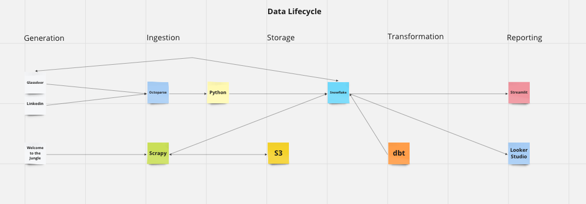
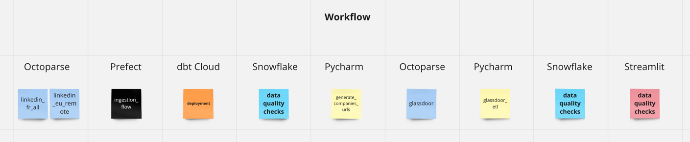
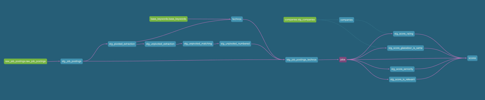

# Job Radar 2.0

The objective of the project is the same as in [version 1](https://github.com/FelitaD/job-radar-1.0): 
analyse the data engineering job market to orient my job search.

The main difference is in technologies used.

# Overview
Schemas of the project: [Data Flow Miro board](https://miro.com/app/board/uXjVMNceW10=/?share_link_id=441240647617)

## Data lifecycle

## Workflow

## Components

### Scrapy crawler

### Octoparse

### Postgres

### Snowflake

### dbt

### Looker Studio

### Streamlit

### Prefect

### Data Modeling

