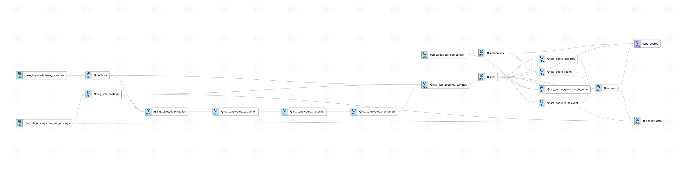

# Job Radar 2.0

Version 2 of [Job Radar 1.0](https://github.com/FelitaD/job-radar-1.0) by modifying technologies used.
 Focus is emphasized on analytics engineering using [Snowflake](https://www.snowflake.com/en/) coupled with [dbt](https://www.getdbt.com/) 
and visualisations in Looker Studio and Streamlit. Orchestration with Prefect. Data modeling with Data Vault.

# Overview
Schemas of the project: [Data Flow Miro board](https://miro.com/app/board/uXjVMNceW10=/?share_link_id=441240647617)

## Data lifecycle

## Workflow

## Components

### Scrapy crawler

### Octoparse

### Postgres

### Snowflake

### dbt

### Looker Studio

### Streamlit

### Prefect

### Data Modeling

